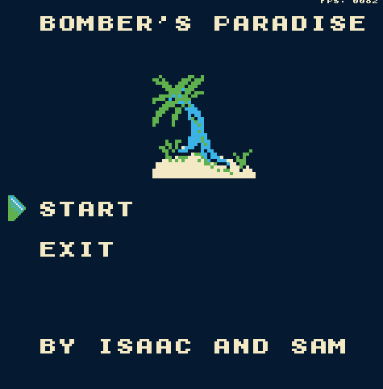

# Bombers Paradise
The original Bomberman, but with a twist!
Created as an entry in Ludum Dare #51 in October 2022 with the theme of "Every 10 seconds".
I never finished it in time and was left on an old computer only to be resurrected today!

## Installation
So far, no binaries are available but that should change once I get to a more complete state.

You can compile the project for Windows (Linux is untested, and likely doesn't work) and requires the following libraries:
- SDL2
- SDL2_image
- SDL2_mixer
(Will update to SDL3 in the next little bit)

## License
Public domain.